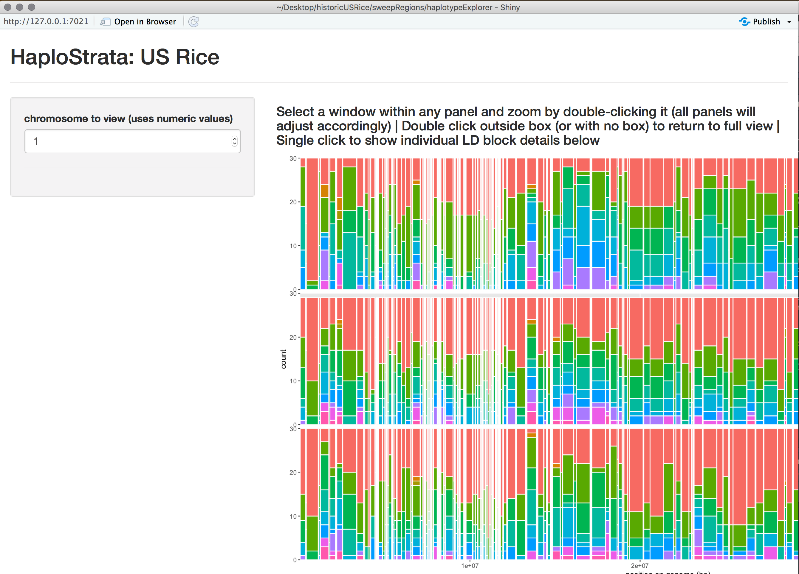

# HaploStrata: US Rice
An app for examining haplotype structure through time . . . it's simple: just four dimensional genomic geology.
Default data is from US rice breeding over the last century (Vaughn et al. 2020).   

## Installation and Implementation:

This app is designed to be run under RStudio as a Shiny app.  

0. Install dependancies: [RStudio](https://www.rstudio.com/products/rstudio/download/) then, using Rstudio package manager, install ggplot2 and shiny libraries if not already installed.
1. Download this repository using "Clone or download" button; "Download ZIP"
2. Unzip the file in the location of your choice
3. Open haploStrata.R in RStudio
4. Press "Run App" button

## Exploring haplotypes

The data from chromosome 1 is loaded automatically, but can be changed in the selection bar.

The up-and-running app will initially look something like this:

	
You can zoom in on a region of the genome by dragging a box and double clicking within it.  All three era panels update regardless of which panel you dragged the box across.  Find an interesting LD block or go to a position of interest and single-click on it.  A heatmap showing the different haplotype sequences will appear.  (You may have to scroll down to see it.)  You can check the exact coordinates you are viewing in the gray box at the very bottom of the page that shows all LD block information.

If you want to download the SNP/sample matrix for the LD block you've selected, click the first bar above the raw block information.  

If you want to download sample/variety information and the haplotype calls per each sample, click the second bar.

## Citation:
coming soon
